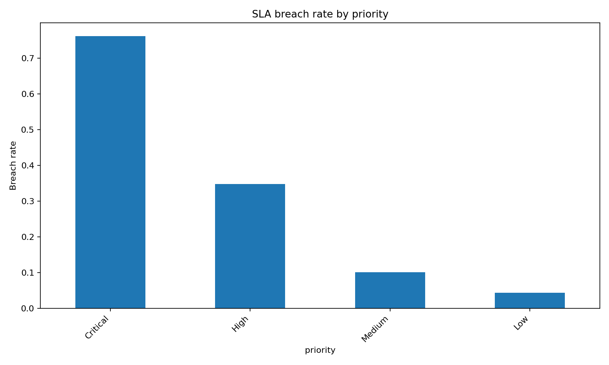
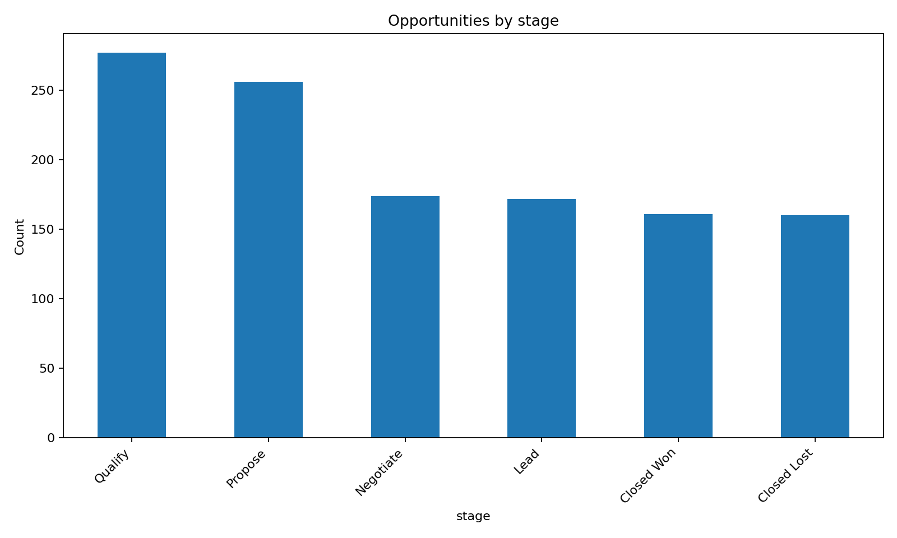

# Dynamics 365 ERP/CRM KPI Pipeline

> End-to-end analytics demo: synthetic Dynamics-like CRM/ERP data → ETL → KPI layer → baseline ML (SLA breach risk) — built to showcase Dynamics 365 / Dataverse analytics skills.

---

## Quick Links

| What | Link |
|---|---|
| 🗂️ **Repository root** | https://github.com/sebsv123/dynamics365-erp-crm-kpi-pipeline/tree/main |
| 📓 **Quickstart notebook** (rendered) | https://nbviewer.org/github/sebsv123/dynamics365-erp-crm-kpi-pipeline/blob/main/notebooks/00_Quickstart.ipynb |
| 📓 **SLA Risk model notebook** (rendered) | https://nbviewer.org/github/sebsv123/dynamics365-erp-crm-kpi-pipeline/blob/main/notebooks/01_Model_SLA_Risk.ipynb |
| 🐍 `src/generate_data.py` | https://github.com/sebsv123/dynamics365-erp-crm-kpi-pipeline/blob/main/src/generate_data.py |
| 🐍 `src/etl.py` | https://github.com/sebsv123/dynamics365-erp-crm-kpi-pipeline/blob/main/src/etl.py |
| 🐍 `src/kpis.py` | https://github.com/sebsv123/dynamics365-erp-crm-kpi-pipeline/blob/main/src/kpis.py |
| 🐍 `src/model.py` | https://github.com/sebsv123/dynamics365-erp-crm-kpi-pipeline/blob/main/src/model.py |
| 🐍 `src/plots.py` | https://github.com/sebsv123/dynamics365-erp-crm-kpi-pipeline/blob/main/src/plots.py |
| 🐍 `src/d365_connector_template.py` | https://github.com/sebsv123/dynamics365-erp-crm-kpi-pipeline/blob/main/src/d365_connector_template.py |
| 📊 `outputs/kpi_table.csv` | https://github.com/sebsv123/dynamics365-erp-crm-kpi-pipeline/blob/main/outputs/kpi_table.csv |
| 📊 `outputs/model_metrics.json` | https://github.com/sebsv123/dynamics365-erp-crm-kpi-pipeline/blob/main/outputs/model_metrics.json |
| 🖼️ SLA breach chart | https://github.com/sebsv123/dynamics365-erp-crm-kpi-pipeline/blob/main/outputs/sla_breach_by_priority.png |
| 🖼️ Opportunities chart | https://github.com/sebsv123/dynamics365-erp-crm-kpi-pipeline/blob/main/outputs/opportunities_by_stage.png |
| 📋 Demo checklist | https://github.com/sebsv123/dynamics365-erp-crm-kpi-pipeline/blob/main/docs/demo_checklist.md |

---

## Why this matches a Dynamics 365 internship

- **Real entity model** — Account, Opportunity (Sales), Case + SLA/CSAT (Customer Service), Work Order (Field Service) mirror the actual Dynamics 365 modules.
- **Dataverse-ready connector** — `src/d365_connector_template.py` shows how to authenticate with MSAL, call the Dataverse Web API (`/api/data/v9.2/`), and query tables with OData.
- **Actionable KPIs** — SLA compliance rate, average resolution time, CSAT, win rate, and open pipeline value are the metrics Dynamics dashboards surface every day.
- **ML on CRM data** — a baseline SLA breach-risk classifier (LogisticRegression + OneHotEncoder) demonstrates how model scores could be written back to Dataverse as a custom field for proactive case management.

---

## Repo structure

```
dynamics365-erp-crm-kpi-pipeline/
├── src/
│   ├── __init__.py
│   ├── generate_data.py          # synthetic Dynamics-like raw tables
│   ├── etl.py                    # parse, join, quality-check, feature table
│   ├── kpis.py                   # compute & export KPIs
│   ├── model.py                  # SLA breach risk model
│   ├── plots.py                  # README visualisations
│   └── d365_connector_template.py# Dataverse Web API stub
├── notebooks/
│   ├── 00_Quickstart.ipynb       # full pipeline walkthrough
│   └── 01_Model_SLA_Risk.ipynb   # model deep-dive + confusion matrix
├── outputs/                      # generated by scripts (PNGs tracked)
├── docs/
│   └── demo_checklist.md
├── .gitignore
├── requirements.txt
└── README.md
```

---

## Data model

| Entity | Key fields | Dynamics 365 module |
|---|---|---|
| **Account** | account_id, country, segment, tier, employees, tenure_months | Sales / Core |
| **Opportunity** | opportunity_id, account_id, stage, amount_eur, close_at, is_won | Sales |
| **Case** | case_id, account_id, priority, channel, case_type, sla_hours, resolution_hours, sla_breached, csat | Customer Service |
| **Work Order** | work_order_id, account_id, wo_type, planned_hours, actual_hours, on_time | Field Service |
| **SLA** | Encoded as `sla_hours` on each Case (Low=72h, Medium=48h, High=24h, Critical=8h) | Customer Service |
| **CSAT** | `csat` score 1–5 derived from resolution time and SLA outcome | Customer Service |

---

## Quickstart (CLI)

```bash
pip install -r requirements.txt

python -m src.generate_data   # → data/raw/*.csv
python -m src.etl             # → data/processed/case_features.csv + outputs/data_quality_report.csv
python -m src.kpis            # → outputs/kpi_table.csv
python -m src.model           # → outputs/model_metrics.json
python -m src.plots           # → outputs/sla_breach_by_priority.png + outputs/opportunities_by_stage.png
```

---

## Notebook guide

| Notebook | Description |
|---|---|
| `notebooks/00_Quickstart.ipynb` | Runs the **full pipeline** end-to-end via `subprocess`, displays KPI table, model metrics, and both plots inline. Good first notebook to open. |
| `notebooks/01_Model_SLA_Risk.ipynb` | Deep-dive on the SLA breach risk model: feature engineering, training, classification report, confusion matrix, and top logistic-regression coefficients. |

---

## KPI catalogue

### Support KPIs

| Metric | Description |
|---|---|
| `support_total_cases` | Total number of Cases in the period |
| `support_sla_compliance_rate` | % of Cases resolved within their SLA target |
| `support_avg_resolution_hours` | Mean time from case creation to resolution |
| `support_avg_csat` | Average customer satisfaction score (1–5) |
| `support_sla_breach_rate_<priority>` | SLA breach rate broken down by ticket priority |

### Sales KPIs

| Metric | Description |
|---|---|
| `sales_closed_won` | Count of Opportunities in "Closed Won" stage |
| `sales_closed_lost` | Count of Opportunities in "Closed Lost" stage |
| `sales_win_rate` | Closed Won / (Closed Won + Closed Lost) |
| `sales_open_pipeline_value_eur` | Total EUR value of Opportunities still in active stages |

---

## ML model — SLA breach risk

| Item | Detail |
|---|---|
| **Algorithm** | `LogisticRegression` with `class_weight='balanced'` |
| **Encoding** | `OneHotEncoder` via `ColumnTransformer` for categorical features |
| **Features** | priority, channel, case_type, country, segment, tier, employees, tenure_months, created_dow, created_hour, sla_hours |
| **Target** | `sla_breached` (binary: 1 = resolution time exceeded SLA) |
| **Metrics file** | `outputs/model_metrics.json` |
| **ROC AUC** | ≈ 0.83 |
| **Avg Precision** | ≈ 0.60 |

**Key result:** Priority and case type are the strongest drivers of SLA breach risk, which aligns with domain knowledge — Critical Outage tickets are the hardest to resolve within their tight 8-hour window.

---

## Outputs

| File | Generated by |
|---|---|
| `data/raw/accounts.csv` | `src.generate_data` |
| `data/raw/opportunities.csv` | `src.generate_data` |
| `data/raw/cases.csv` | `src.generate_data` |
| `data/raw/work_orders.csv` | `src.generate_data` |
| `data/processed/case_features.csv` | `src.etl` |
| `outputs/data_quality_report.csv` | `src.etl` |
| `outputs/kpi_table.csv` | `src.kpis` |
| `outputs/model_metrics.json` | `src.model` |
| `outputs/sla_breach_by_priority.png` | `src.plots` |
| `outputs/opportunities_by_stage.png` | `src.plots` |

---

## Connecting to real Dataverse

See `src/d365_connector_template.py` for a fully annotated stub that covers:

1. Registering an app in **Azure Entra ID** and granting the `Dynamics CRM → user_impersonation` permission
2. Acquiring a token with **MSAL** (`ConfidentialClientApplication` for daemon/service flows)
3. Calling the **Dataverse Web API** (`/api/data/v9.2/`) with OData `$select` / `$top` / `$filter`

Two helper functions are provided:
- `dataverse_get_whoami(access_token, base_url)` — verify connectivity
- `dataverse_query_table(access_token, base_url, logical_name, select, top)` — generic table query (e.g. `logical_name="incidents"` for Cases)

---

## Plots



